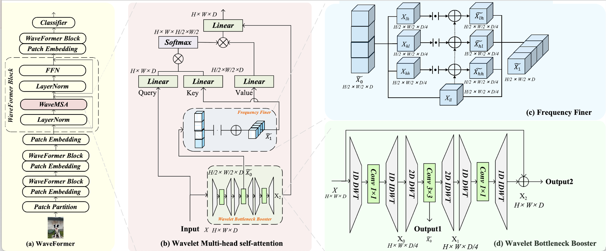
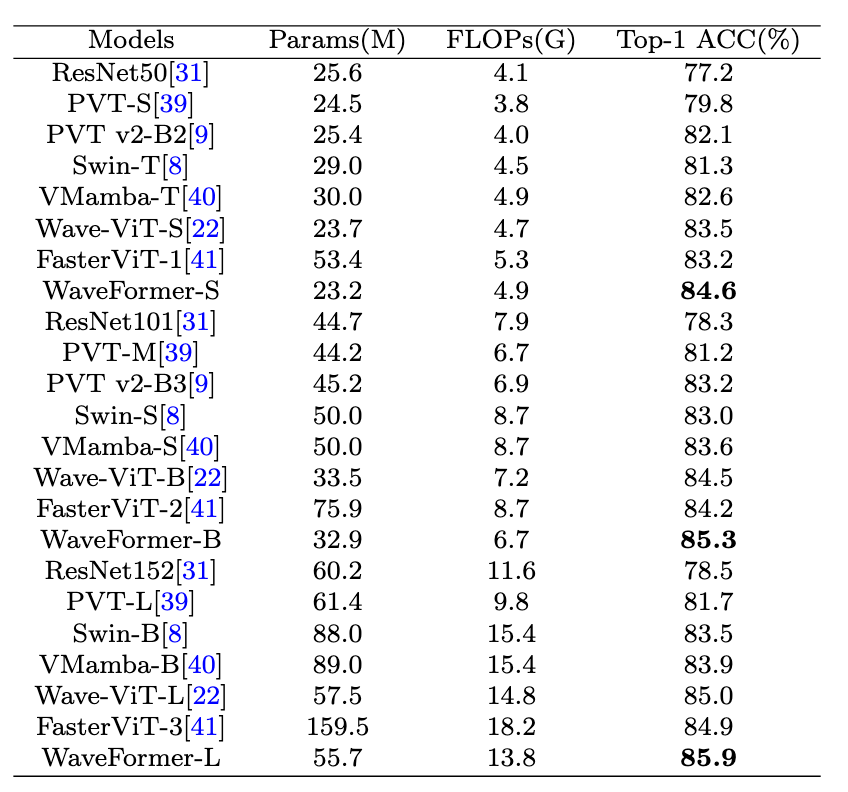
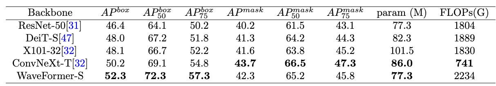
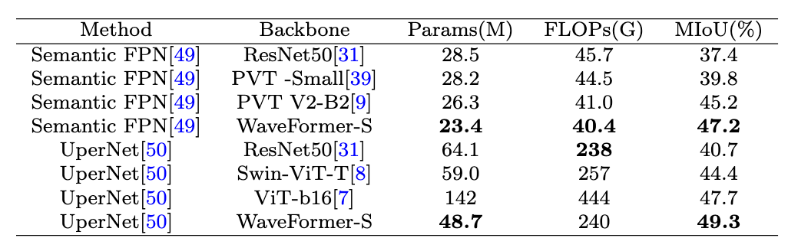

## Enhancing Vision Transformers with Wavelet Bottleneck Boosters for Efficient Multi-head Self-Attention

## Introduction



1. In this work, considering the issues of high computational burden and neglecting local image information in traditional Multi-head Self-Attention, we innovatively designed the WaveMSA.
2. Under a unified development framework, by leveraging wavelet transform, WaveMSA can enhance the representational ability of global and local features while reducing computational complexity. Notably, we conducted an in-depth exploration of how to utilize the high-frequency information of wavelets to further improve the performance of WaveMSA in handling local detail.
3. In the specific design of WaveMSA, we develop a Wavelet Bottleneck Booster utilizing DWT&IDWT in both 1D and 2D versions for channel and spatial domains, respectively. This approach effectively captures local details across spatial, frequency, and channel domains in a unified framework.

### Requirement:

* PyTorch 1.8.0+
* Python3.8
* CUDA 10.1+
* [timm](https://github.com/rwightman/pytorch-image-models)==0.4.5
* [tlt](https://github.com/zihangJiang/TokenLabeling)==0.1.0
* pyyaml
* apex-amp

## Getting started

1. Data preparation: Please prepare [ImageNet1K](http://image-net.org/),[COCO](https://cocodataset.org/),[ADE20K](https://groups.csail.mit.edu/vision/datasets/ADE20K/).
2. Training:

   ```python
   image classification:
   python -m torch.distributed.launch --nproc_per_node=8 --nnodes=1 --node_rank=0 --master_addr="localhost" --master_port=12347 --use_env main.py  --epochs 400 --batch-size 12

   object detection:
   dist_train.sh configs/wavemsa/mask_rcnn_wavemsa_s_fpn_1x_coco.py.py 8

   Semantic Segmentation 
   tools/dist_train.sh configs/wavemsa/wavemsa_s_512x512_160k_ade20k.py 8

   ```

## Result

### Image Classification on ImageNet1k



### Object Detection on COCO dataset




### Semantic Segmentation on ADE20K



## Citing WaveFormer

```bibtex
@article{xiangyangli2025wavemsa,
  title={Enhancing Vision Transformers with Wavelet Bottleneck Boosters for Efficient Multi-head Self-Attention},
  author={Xiangyang Li, Yafeng Li, Ning Li, Pan Fan, Xueya Zhang,Wenbo Zhang},
  journal={The Visual Computer}
  publisher={Springer}
}
```
