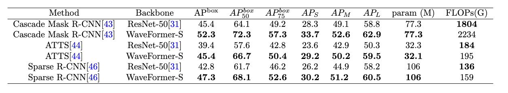

## WaveMSA

the code of Enhancing Vision Transformers with Wavelet Bottleneck Boosters for Efficient Multi-head Self-Attention.

## Introduction


1. In this work, considering the issues of high computational burden and neglecting local image information in traditional Multi-head Self-Attention, we innovatively designed the WaveMSA.
2. Under a unified development framework, by leveraging wavelet transform, WaveMSA can enhance the representational ability of global and local features while reducing computational complexity. Notably, we conducted an in-depth exploration of how to utilize the high-frequency information of wavelets to further improve the performance of WaveMSA in handling local detail.
3. In the specific design of WaveMSA, we develop a Wavelet Bottleneck Booster utilizing DWT&IDWT in both 1D and 2D versions for channel and spatial domains, respectively. This approach effectively captures local details across spatial, frequency, and channel domains in a unified framework.
4. Base on WaveMSA, we develop WaveFormer to achieve a high-efficiency transformer backbone. WaveFormer demonstrates strong performance across various vision applications, including image classification, object detection, and semantic segmentation.

### Requirement:

To run this project, you'll need to have the following libraries installed:

* Python3.8
* CUDA 10.1+
* PyTorch
* torchvision
* matplotlib
* pytorch\_wavelets
* PyWavelets
* sklearn.metrics

## Getting started

### Step 1: Environment Setup

````bash
# Create conda environment
conda create -n wavemsa python=3.8 -y
conda activate wavemsa

# Install PyTorch
pip install pytorch==1.12.1 torchvision==0.13.1 cudatoolkit=11.3 -c pytorch

# Install dependencies
pip install -r requirements.txt

# Install Apex for mixed-precision training
git clone https://github.com/NVIDIA/apex
cd apex && pip install -v --disable-pip-version-check --no-cache-dir --global-option="--cpp_ext" --global-option="--cuda_ext" ./

````

### Step 2: Data Preparation

Please download datasets:

[ImageNet1K](http://image-net.org/):http://image-net.org/

[COCO](https://cocodataset.org/):https://cocodataset.org/

[ADE20K](https://groups.csail.mit.edu/vision/datasets/ADE20K/):https://groups.csail.mit.edu/vision/datasets/ADE20K/

Organize your dataset in the following structure:

```bash

    -- datasets
       -- coco
            -- annotations
            -- train2017
            -- val2017
            -- test2017
       -- imagenet1k
            -- train
            -- val
            -- annotations
       -- ADEChallengeData2016
          --annotations
              --training
              --validation
          --images/
             --training/
            --validation/
           -- objectInfo150.txt  
 
```

### Step 3: Train and Test the model

Train your model and save the best model .

```python
Image Classification:
python -m torch.distributed.launch
       --nproc_per_node=8
       --nnodes=1
       --node_rank=0
       --master_addr="localhost"
       --master_port=12347
       --use_env main.py
       --epochs 400
       --batch-size 12

Object Detection:
dist_train.sh configs/wavemsa/mask_rcnn_wavemsa_s_fpn_1x_coco.py.py 8
dist_train.sh configs/wavemsa/retinanet_wavemsa_s_fpn_1x_coco.py 8
dist_train.sh configs/wavemsa/atss_wavemsa_s_fpn_3x_mstrain_fp16.py 8
dist_train.sh configs/wavemsa/sparse_rcnn_wavemsa_s_fpn_300_proposals_crop_mstrain_480-800_3x_coco.py 8

dist_test.sh configs/wavemsa/mask_rcnn_wavemsa_s_fpn_1x_coco.py.py 8
dist_test.sh configs/wavemsa/retinanet_wavemsa_s_fpn_1x_coco.py 8
dist_test.sh configs/wavemsa/atss_wavemsa_s_fpn_3x_mstrain_fp16.py 8
dist_test.sh configs/wavemsa/sparse_rcnn_wavemsa_s_fpn_300_proposals_crop_mstrain_480-800_3x_coco.py 8

Semantic Segmentation 
tools/dist_train.sh configs/wavemsa/wavemsa_s_512x512_160k_ade20k.py 8
tools/dist_test.sh configs/wavemsa/wavemsa_s_512x512_160k_ade20k.py 8
```

## 📂 Project Structure

WaveMSA Project Structure. We provide the location of the core code

```bash
image_classification
├── DWT_IDWT1
│   ├── DWT_IDWT_Functions.py
│   ├── DWT_IDWT_layer.py
│   └── wavelet_util.py
├── configs #config code
│   └── wavevmsa
│       ├── wavemsa_b.py
│       ├── wavemsa_l.py
│       └── wavemsa_s.py
├── datasets.py
├── engine.py
├── loss
├── losses.py
├── main.py
├── torch_wavelets.py
├── util
├── utils.py
├── wave_conv.py
└── wavemsa.py #core code

object_detection
├── configs
│   └── wavemsa #core code
│       ├── atss_wavemsa_s_fpn_3x_mstrain_fp16.py
│       ├── cascade_mask_rcnn_wavemsa_s_fpn_3x_mstrain_fp16.py
│       ├── mask_rcnn_wavemsa_b_fpn_1x_coco.py
│       ├── mask_rcnn_wavemsa_s_fpn_1x_coco.py
│       ├── retinanet_wavemsa_b_fpn_1x_coco.py
│       ├── retinanet_wavemsa_s_fpn_1x_coco.py
│       └── sparse_rcnn_wavemsa_s_fpn_300_proposals_crop_mstrain_480-800_3x_coco.py
├── dist_test.sh
├── dist_train.sh
├── mmcv_custom
├── mmdet_custom
├── train.py
└── wavemsa.py#core code

semantic_sgemention
── build
│   └── lib
│       ├── mmcv_custom
│       └── mmseg
│           ├── models
│           │   ├── backbones
│           │   │   ├── ******
│           │   │   └── wavevit.py #core code
├── configs
│   ├── _base_
│   │   ├── models
│   │   │   └── upernet_wavevit.py#core code
******
│   └── wavemsa
│       └── wavemsa_s_512x512_160k_ade20k.py#core code
├── mmcv_custom
├── mmseg
│   ├── models
│   │   ├── backbones
│   │   │   └── wavemsa.py #core code
├── tools
│   ├── benchmark.py
│   ├── convert_datasets
│   ├── dist_test.sh
│   ├── dist_train.sh
│   ├── test.py
│   └── train.py
```

### Core Code

The core of WaveMSA.

```python
class WaveAttention(nn.Module):
    def __init__(self, dim, num_heads, sr_ratio):
        super().__init__()
        self.num_heads = num_heads
        head_dim = dim // num_heads
        self.scale = head_dim**-0.5
        self.sr_ratio = sr_ratio
        self.dwt = DWT_2D(wave='haar')
        self.idwt = IDWT_2D(wave='haar')
        #WBB customer ConvBNReLU1x1 base on the 1D wavelet
        self.reduce = nn.Sequential(
            ConvBNReLU1x1(dim,dim//4,  padding=0, stride=1),
            nn.BatchNorm2d(dim//4),
            nn.ReLU(inplace=True),
        )
        #WBB customer ConvBNReLU1x1 base on the 1D wavelet
        self.resume = nn.Sequential(
            ConvBNReLU1x1(dim//4,dim,  padding=0, stride=1),
            nn.BatchNorm2d(dim//4),
            nn.ReLU(inplace=True),
        )
        self.filter = nn.Sequential(
            nn.Conv2d(dim, dim, kernel_size=3, padding=1, stride=1, groups=4),
            nn.BatchNorm2d(dim),
            nn.ReLU(inplace=True),
        )
        self.kv_embed = nn.Conv2d(dim, dim, kernel_size=sr_ratio, stride=sr_ratio) if sr_ratio > 1 else nn.Identity()
        self.q = nn.Linear(dim, dim)
        self.kv = nn.Sequential(
            nn.LayerNorm(dim),
            nn.Linear(dim, dim * 2)
        )
        self.proj = nn.Linear(dim+dim, dim)
        self.apply(self._init_weights)

    def forward(self, x, H, W):
        B, N, C = x.shape
        q = self.q(x).reshape(B, N, self.num_heads, C // self.num_heads).permute(0, 2, 1, 3)
        x = x.view(B, H, W, C).permute(0, 3, 1, 2)
        temp=self.reduce(x)
        x_dwt=self.dwt(temp)
        x_dwt = self.filter(x_dwt)
        x_idwt = self.idwt(x_dwt)
        x_idwt=self.resume(x_idwt)
        x_idwt=x+x_idwt
        x_idwt = x_idwt.view(B, -1, x_idwt.size(-2) * x_idwt.size(-1)).transpose(1, 2)
        #Frequency Finer
        num = (x_dwt.shape[1]) // 4
        x_ll, x_lh, x_hl, x_hh = torch.split(x, num, dim=1)
        x_lh=torch.abs(x_lh)+x_ll
        x_hl=torch.abs(x_hl)+x_ll
        x_hh=torch.abs(x_hh)+x_ll
        x_dwt = torch.cat([x_ll, x_lh, x_hl, x_hh], dim=1)
        kv = self.kv_embed(x_dwt).reshape(B, C, -1).permute(0, 2, 1)
        kv = self.kv(kv).reshape(B, -1, 2, self.num_heads, C // self.num_heads).permute(2, 0, 3, 1, 4)
        k, v = kv[0], kv[1]
        attn = (q @ k.transpose(-2, -1)) * self.scale
        attn = attn.softmax(dim=-1)
        x = (attn @ v).transpose(1, 2).reshape(B, N, C)
        x = self.proj(torch.cat([x, x_idwt], dim=-1))
        return x


```

The WaveMSA module implements a novel attention mechanism combining wavelet transforms and self-attention, with the following key components:

**Structural Components**:

* **WBB**: Achieves convolution in the 1D wavelet domain by customizing the ConvBNReLU1x1 module .
* **Frequency Finer**: Enhances feature representation by incorporating high-frequency components as weights into low-frequency components.
* **WaveMSA**: Seamlessly integrates WBB and Frequency Finer into the Multi-head Self-Attention (MSA) mechanism, forming a WaveMSA module.


## Citation

If you use this work, please acknowledge our manuscript:
**"Enhancing Vision Transformers with Wavelet Bottleneck Boosters for Efficient Multi-head Self-Attention"**
Authors: Xiangyang Li, Yafeng Li, Ning Li, Pan Fan, Xueya Zhang, Wenbo Zhang, Qian Wang

Journal: *The Visual Computer*
Status: With Editor at *The Visual Computer* (2025).

```bibtex
@article{li2025wavemsa,
title={Enhancing Vision Transformers with Wavelet Bottleneck Boosters for Efficient Multi-head Self-Attention},
author={Li, Xiangyang and Li, Yafeng and Li, Ning and Fan, Pan and Zhang, Xueya and Zhang, Wenbo and Wang, Qian},
journal={The Visual Computer}, 
year={2025},
publisher={Springer}}
```

## Result

### Image Classification on ImageNet1k


### Object Detection on COCO dataset




### Semantic Segmentation on ADE20K


```
